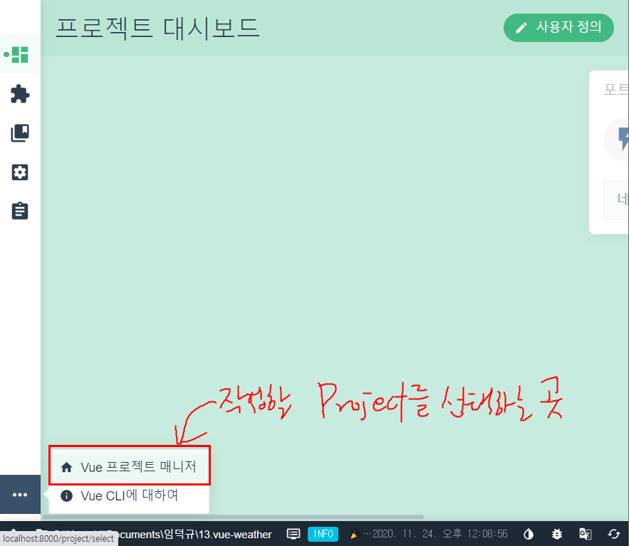

# Vue 프로젝트 시작하기

## 설치(한번만)
- Terminal 창에서 아래의 명령을 실행하여 vue를 설치한다
```bash
npm i -g @vue/cli
```

## 실행(프로젝트를 진행할때)
- 설치가 완료되면 아래의 명령을 터미널창(cmd, bash, vscode 어디서든)에서 아래의 명령을 실행한다. (아래의 명령은 프로젝트를 생성, 수정, 삭제, 작업 등 모든 vue작업을 할때 꼭 실행해야 한다)
```bash
vue ui
```
### 신규 프로젝트 진행시 - 프로젝트 만들기
1. 아래화면에서 만들기를 클릭


2. 작업할 폴더를 찾아서 이동 후 프로젝트 만들기를 클릭


3. 아래의 그림처럼 설정 후 진행


4. 수동을 선택후 진행


5. Vue Version, Babel, css-Preprocessor, vuex, router 선택


6. Vue Version(2.x) 선택, dart-scss 선택


7. 선택한 설정을 저장


8. 프로젝트 완성


### 만들어진 프로젝트를 작업하기
1. vue ui 실행
```bash
vue ui
```
2. 프로젝트 매니저 클릭



3. 작업목록 클릭


4. 작업시작

